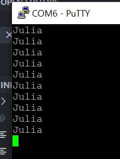
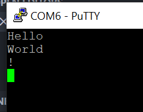

# InbyggdaSystemLabb

## commit - 1: uppgift 1

I(led_max) = 25 mA

Resistorstorlek = 5V / 25mA = 200 Ohm

Så för säkerhet, välja 220 Ohm

Arduino Uno 

## commit - 2: uppgift 2

Putty print ut

## commit - 3: uppgift 3

Putty läsa in och printa ut

